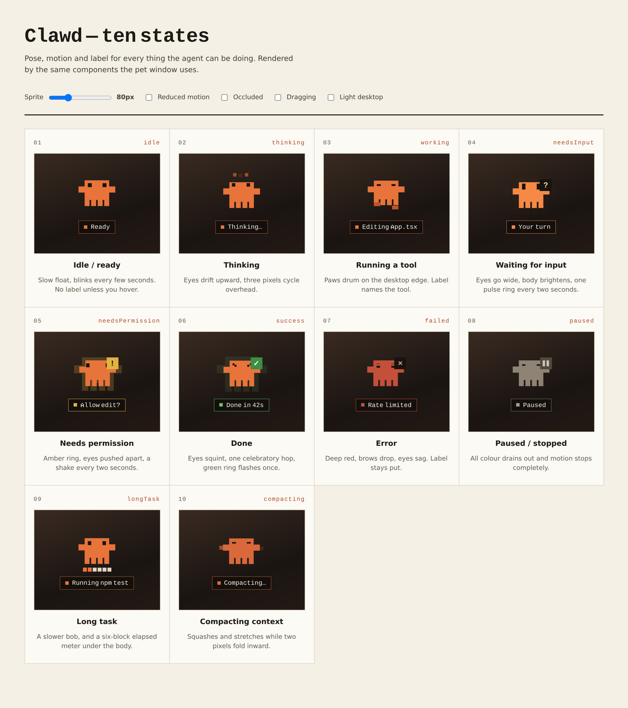
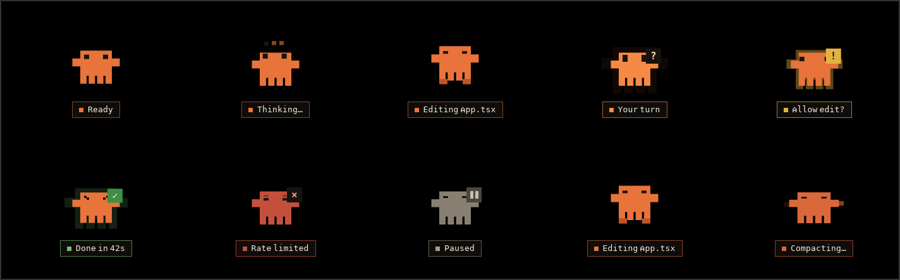

# Clawd

A pixel-art desktop status pet for Claude Code.

Clawd floats above your other windows and says what Claude Code is doing
through pose, colour, motion and a short label — so you do not have to switch
back to the terminal to find out whether Claude is working, blocked, done, or
dead.



Running, with the dev harness driving every state through the real pipeline:



---

## Status

This is v1 of the implementation spec: the window, the state machine, the ten
states, and a developer harness that drives all of them. **There is no real
Claude Code integration yet** — that is deliberately its own spec. v1 ships
`MockSource`, and the `SessionEvent` seam is built so `HookSource` drops in
without the state machine ever learning that Claude Code exists.

So in a release build the pet sits at `Idle / Ready`, because nothing is being
observed. Run `npm run tauri:dev` and press `1`–`0` to see it work.

Platforms: **macOS and Windows**. Linux is out of scope and the reason is in
[§2.1 of the spec](#why-not-linux).

## Running it

```sh
npm install
npm run tauri:dev      # the pet, with the dev harness compiled in
npm run gallery        # all ten states in a browser, no desktop needed
```

### The dev harness

`npm run tauri:dev` passes `-f devtools`. Without that feature the harness is
not compiled at all, so no path exists by which a debug surface reaches a user.

| Key | Asks for |
|---|---|
| `1`–`9`, `0` | Idle, Thinking, Working, Needs input, Needs permission, Success, Failed, Paused, Long task, Compacting |
| `s` | A scripted run — a realistic timed sequence |
| `o` | An event from a second session |
| `t` | Shrink the timers |

These inject into `MockSource` and flow through the real state machine, the
real IPC and the real renderer. They do not set states. Pressing `9` asks for
the tool call that *earns* the long-task pose, and the pose arrives only when
the timer says so — the harness cannot produce a state the machine would not.

The same three extras are in the tray menu under `Dev ·`.

## Shipping it

```sh
npm run tauri:build
```

## How it is put together

```
crates/clawd-core/   the state machine. No Tauri, no webview, no UI.
src-tauri/           the native shell: window, tray, hit testing, IPC.
src/renderer/        the isolated render boundary.
src/label/           chip timing, deliberately outside that boundary.
```

**The state machine is in Rust, not React.** The webview can be occluded,
throttled or suspended by the OS, and state has to survive that. Rust also owns
the timers and is what later grows an action channel. React is a pure render
target: it receives a state and draws it.

**`clawd-core` has no UI dependency**, and `src-tauri` is excluded from the
root Cargo workspace. That is what lets `cargo test` run the whole pipeline on
any machine, with or without a platform webview — including CI.

**The renderer takes a state plus label text and draws.** No timers, no
derivation, no knowledge of sessions or hooks. Being strict about this is what
keeps a swap to a canvas renderer reachable if WebView2's resident footprint
misses budget; it would touch only `src/renderer/`.

## Testing

```sh
cargo test           # the state machine, the labels, the DPI snap
npm test             # chip timing, and the renderer's contract
npm run build        # typecheck + production bundle
```

`cargo test` covers the full transition table, ownership and sticky blocking
states against a second session, all three timers on an injected clock, label
derivation, the scripted run end to end, and the DPI snap. The timers are
tested by arithmetic rather than by sleeping, so the suite is fast and cannot
flake.

The shell was also run end to end under a virtual X server during development
— every state driven by the real number keys, the long-task and success timers
earned by the clock, a permission prompt held against five injections from a
second session, and a drag persisted and restored across a restart. That
exercised the shared code and the pipeline; the macOS and Windows specifics in
`src-tauri/src/platform/` are cross-compiled and type-checked but can only be
*observed* on those platforms.

`gallery.html` is a visual check only. It drives the renderer directly and
deliberately does not stand in for the pipeline tests — a dev surface that
wrote straight to the view would let the machine be wrong while every state
still looked correct.

## Things worth knowing

**The meter is elapsed time, not progress.** The prototype's six-block meter
reads as a progress bar, and hooks carry no progress percentage. Rather than
invent one, the blocks fill on a fixed cadence and cycle. For the same reason
there is no `2 tests failed` label: parsing test output is screen-scraping in
better clothes. A test asserts no label can ever claim either.

**Clawd is read-only.** The prototype's context menu implies control — "Pause
session", "Open terminal" — but hooks are an observation channel. There is no
mechanism for an external app to reach into a running session and pause it or
answer a prompt, so those items are not built. The tray carries show/hide, snap
to corner, reset position and quit.

**Reduced motion does not mean no motion.** Motion *is* the signal here, so
disabling animation would silently break the app. Instead each state collapses
to its distinguishing pose and colour, held statically, and the label becomes
persistent rather than auto-fading to carry what the motion no longer can.

**A silent session eventually reads as stopped.** If Claude Code is killed
outright no end event fires, and Clawd would sit on `Working` indefinitely,
confidently reporting something that stopped ten minutes ago. Any busy state
drops to `Paused` after a quiet period.

**There is no drop ghost.** The prototype illustrates a dashed outline left
behind while dragging. The window itself is what moves, so there is nothing to
draw a ghost against without a second always-on-top window. The tilt is
implemented; the ghost is not.

### Why not Linux

Wayland has no global coordinate system, so `set_position` silently does
nothing, and `always_on_top` is unsupported. Both no-op rather than erroring.
That removes staying above other windows, opening in a default corner, and
drag-to-reposition — which is most of what this app is. `wlr-layer-shell` is
the only escape hatch and GNOME's compositor does not implement it.

X11 works, and Tauri under XWayland inherits X11 behaviour, so Linux is
deferred rather than impossible.

## Footprint

§9.5 makes measured footprint the gate on whether the canvas renderer gets
picked up. Numbers have to come from real desktops, so the table is here to be
filled in:

| Platform | Resident memory (idle) | CPU (idle) | Budget |
|---|---|---|---|
| macOS | — | — | — |
| Windows | — | — | — |

Method: leave Clawd at `Idle` for ten minutes with no session attached, then
read RSS from Activity Monitor or Task Manager and average CPU over a minute.
Two things run continuously and count against this: the 250 ms state-machine
tick, and the 80 ms cursor poll that drives hit testing.

## Credits

The sprite, palette and motion are ported from `Claude_Code_Avatar.dcv2.html`,
which is canonical. The bundled font is
[Pixelify Sans](https://fonts.google.com/specimen/Pixelify+Sans), under the SIL
Open Font License 1.1.
