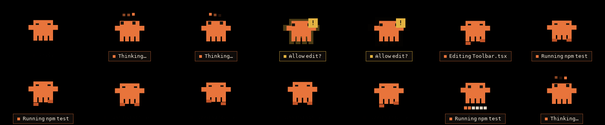
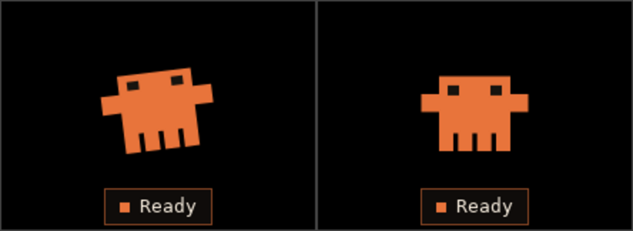

# Clawd

A pixel-art desktop status pet for Claude Code.

Clawd floats above your other windows and says what Claude Code is doing
through pose, colour, motion and a short label — so you do not have to switch
back to the terminal to find out whether Claude is working, blocked, done, or
dead.


Running, with the dev harness driving every state through the real pipeline:


---

## Status

v1 was the window, the state machine, the ten states and a developer harness
that drives all of them, with `MockSource` as the only event producer. v2 adds
`HookSource`: Clawd now watches real Claude Code sessions through hooks.

The seam held. `HookSource` landed without a line of the state machine, the
renderer or the pump changing — the machine still speaks only `SessionEvent`
and still does not know that Claude Code exists. Everything Clawd understands
about hooks is one translation table in `crates/clawd-core/src/hook.rs`.

Run `npm run hooks:install`, start Clawd, and start a session anywhere.

Platforms: **macOS and Windows**. Linux is out of scope and the reason is in
[§2.1 of the spec](#why-not-linux).

## Connecting it to Claude Code

```sh
npm run hooks:install     # merges into ~/.claude/settings.json, with a backup
npm run hooks:uninstall
```

Claude Code's `http` hook type POSTs each event as JSON; Clawd listens on
`127.0.0.1:8787/hook` and translates. That needs no shell script, which is the
whole reason for it — a `command` hook would need one that works under both
PowerShell and bash, and PowerShell startup is 150–400 ms paid twice per tool
call. The bind is loopback only, so it raises no firewall prompt on either
platform.

The installer merges: it finds or creates the matcher group for each event,
drops any entry already pointing at Clawd's URL, and appends a fresh one, so
running it twice is the same as running it once and your own hooks are left
alone. It backs the file up first, and if the file does not parse it refuses
and writes nothing rather than round-tripping your comments away.

| Hook event | Clawd shows |
|---|---|
| `SessionStart` | Idle / Ready |
| `UserPromptSubmit` | Thinking |
| `PreToolUse` | Running a tool — `Editing App.tsx`, `Running npm test` |
| `PostToolUse` | Thinking |
| `PostToolUseFailure` | Error |
| `PermissionRequest` | Needs permission — `Allow edit?` |
| `Notification` (idle / needs input) | Waiting for input |
| `Stop` | Done |
| `StopFailure` | Error, with the reason where there is one |
| `PreCompact` / `PostCompact` | Compacting, then back to Thinking |
| `SessionEnd` | Paused |

Everything else Claude Code sends is understood and deliberately ignored — an
unrecognised hook event is not an error, just something the pet has no pose for.

The port is `8787` unless `CLAWD_HOOK_PORT` says otherwise. If it is already
taken Clawd scans the next four and records what it bound in
`hook-port.json` next to `positions.json`; re-run the installer and it will
point the config at the right one.

To scope Clawd to a single repo instead, put the same block in that project's
`.claude/settings.json` — though a status pet that only watches one repo is not
really a status pet.

### Without Claude Code

Nothing is being observed, so the pet sits at `Idle / Ready`. Run
`npm run tauri:dev` and press `1`–`0` to see every state work.

## Running it

```sh
npm install
npm run tauri:dev      # the pet, with the dev harness compiled in
npm run gallery        # all ten states in a browser, no desktop needed
```

### The dev harness

`npm run tauri:dev` passes `-f devtools`. Without that feature the harness is
not compiled at all, so no path exists by which a debug surface reaches a user.

| Key | Asks for |
|---|---|
| `1`–`9`, `0` | Idle, Thinking, Working, Needs input, Needs permission, Success, Failed, Paused, Long task, Compacting |
| `s` | A scripted run — a realistic timed sequence |
| `o` | An event from a second session |
| `t` | Shrink the timers |

These inject into `MockSource` and flow through the real state machine, the
real IPC and the real renderer. They do not set states. Pressing `9` asks for
the tool call that *earns* the long-task pose, and the pose arrives only when
the timer says so — the harness cannot produce a state the machine would not.

The same three extras are in the tray menu under `Dev ·`. The scripted run is
what surfaces ugly transitions and label thrash, which stepping one state at a
time cannot — here it is, from prompt through a permission request to the
long-task meter being earned by the clock:



Drag from anywhere on the body. Clawd tilts while held and settles on release,
remembering the spot per display:



## Shipping it

```sh
npm run tauri:build
```

## How it is put together

```
crates/clawd-core/   the state machine. No Tauri, no webview, no UI.
src-tauri/           the native shell: window, tray, hit testing, IPC.
src/renderer/        the isolated render boundary.
src/label/           chip timing, deliberately outside that boundary.
```

**The state machine is in Rust, not React.** The webview can be occluded,
throttled or suspended by the OS, and state has to survive that. Rust also owns
the timers and is what later grows an action channel. React is a pure render
target: it receives a state and draws it.

**`clawd-core` has no UI dependency**, and `src-tauri` is excluded from the
root Cargo workspace. That is what lets `cargo test` run the whole pipeline on
any machine, with or without a platform webview — including CI.

**The renderer takes a state plus label text and draws.** No timers, no
derivation, no knowledge of sessions or hooks. Being strict about this is what
keeps a swap to a canvas renderer reachable if WebView2's resident footprint
misses budget; it would touch only `src/renderer/`.

## Testing

```sh
cargo test           # the state machine, the labels, the DPI snap
npm test             # chip timing, and the renderer's contract
npm run build        # typecheck + production bundle
```

`cargo test` covers the full transition table, ownership and sticky blocking
states against a second session, all three timers on an injected clock, label
derivation, the scripted run end to end, and the DPI snap. The timers are
tested by arithmetic rather than by sleeping, so the suite is fast and cannot
flake.

It also covers the hook translation table row by row, and replays realistic
hook transcripts through the machine on an injected clock — an ordinary turn,
a four-minute build that must not read as stalled, a genuinely dead session
that must, three parallel subagents that must not reach the chip, and a
compaction that must return to the turn rather than resetting it. That is the
point of keeping translation in `clawd-core`: it is parsing, not I/O, so the
whole of what Clawd knows about Claude Code is assertable on a box with no
webview and no Claude Code installed.

The listener itself is tested under `cargo test --manifest-path
src-tauri/Cargo.toml` — a real socket, raw requests over `TcpStream`, and the
refusal paths. Those need a platform webview to build, the same caveat that
already applies to `src-tauri/src/platform/`.

The shell was also run end to end under a virtual X server during development
— every state driven by the real number keys, the long-task and success timers
earned by the clock, a permission prompt held against five injections from a
second session, and a drag persisted and restored across a restart. That
exercised the shared code and the pipeline; the macOS and Windows specifics in
`src-tauri/src/platform/` are cross-compiled and type-checked but can only be
*observed* on those platforms.

`gallery.html` is a visual check only. It drives the renderer directly and
deliberately does not stand in for the pipeline tests — a dev surface that
wrote straight to the view would let the machine be wrong while every state
still looked correct.

## Things worth knowing

**What Clawd reads, and what it does not.** The hook payload struct names nine
fields: the event name, the session id, the agent id, the tool name and its
input, the notification type, the error type, and how the session started.
Serde drops everything else, so your prompts, Claude's replies, tool output,
transcript paths and file contents never enter the process at all. A test feeds
a payload with `SECRET` in every one of those and asserts it reaches neither the
event nor the label.

**Bash commands appear on screen.** A tool's target comes from whichever key
its input uses, and for `Bash` that is `command` rather than `description` —
because `Running npm test` is worth more than `Running the test suite`. The
consequence is that a command line can show up on an always-on-top window
during a screen share. Truncation at 30 characters limits it; reordering those
two keys in `hook.rs` removes it, at the cost of the better label.

**Tool failures flash red.** A failed tool call is a real failure and Clawd
says so, but failures are routine — a `Grep` that matches nothing, a test suite
exiting non-zero — and `Failed` is one of the sticky states. Expect the pet to
go red and stay there until that session does something else. It is honest, and
it is loud.

**Subagents are not shown.** They share their parent's session id, and
ownership in the state machine is keyed on exactly that, so three parallel
agents would be three unfiltered writers to one chip — and a subagent
finishing would render `Done` while the main turn was still running. They are
dropped in translation. Showing them properly means keying ownership on
`(session, agent)`, which is a state-machine change rather than a translation
one.

**The watchdog is ten minutes, not two.** A busy state that goes quiet
eventually reads as stopped, and two minutes was fine against a mock whose
longest gap was thirteen seconds. Real hooks fire `PreToolUse` and then nothing
at all until `PostToolUse`, so a build or a test suite is one long silence. Ten
minutes is longer than any plausible single tool call and still short enough
that a killed agent does not lie all afternoon.

**The meter is elapsed time, not progress.** The prototype's six-block meter
reads as a progress bar, and hooks carry no progress percentage. Rather than
invent one, the blocks fill on a fixed cadence and cycle. For the same reason
there is no `2 tests failed` label: parsing test output is screen-scraping in
better clothes. A test asserts no label can ever claim either.

**Clawd is read-only.** The prototype's context menu implies control — "Pause
session", "Open terminal" — but hooks are an observation channel. There is no
mechanism for an external app to reach into a running session and pause it or
answer a prompt, so those items are not built. The tray carries show/hide, snap
to corner, reset position and quit.

**Reduced motion does not mean no motion.** Motion *is* the signal here, so
disabling animation would silently break the app. Instead each state collapses
to its distinguishing pose and colour, held statically, and the label becomes
persistent rather than auto-fading to carry what the motion no longer can.

**A silent session eventually reads as stopped.** If Claude Code is killed
outright no end event fires, and Clawd would sit on `Working` indefinitely,
confidently reporting something that stopped ten minutes ago. Any busy state
drops to `Paused` after a quiet period.

**There is no drop ghost.** The prototype illustrates a dashed outline left
behind while dragging. The window itself is what moves, so there is nothing to
draw a ghost against without a second always-on-top window. The tilt is
implemented; the ghost is not.

### Why not Linux

Wayland has no global coordinate system, so `set_position` silently does
nothing, and `always_on_top` is unsupported. Both no-op rather than erroring.
That removes staying above other windows, opening in a default corner, and
drag-to-reposition — which is most of what this app is. `wlr-layer-shell` is
the only escape hatch and GNOME's compositor does not implement it.

X11 works, and Tauri under XWayland inherits X11 behaviour, so Linux is
deferred rather than impossible.

## Footprint

§9.5 makes measured footprint the gate on whether the canvas renderer gets
picked up. Numbers have to come from real desktops, so the table is here to be
filled in:

| Platform | Resident memory (idle) | CPU (idle) | Budget |
|---|---|---|---|
| macOS | — | — | — |
| Windows | — | — | — |

Method: leave Clawd at `Idle` for ten minutes with no session attached, then
read RSS from Activity Monitor or Task Manager and average CPU over a minute.
Two things run continuously and count against this: the 250 ms state-machine
tick, and the 80 ms cursor poll that drives hit testing.

## Credits

The sprite, palette and motion are ported from `Claude_Code_Avatar.dcv2.html`,
which is canonical. The bundled font is
[Pixelify Sans](https://fonts.google.com/specimen/Pixelify+Sans), under the SIL
Open Font License 1.1.
